# Documento de Ingenieria de Software y Requerimientos

**Proyecto:** Olympo - Pagina web  
**Version:** 1.0  
**Fecha:** 29/05/2026  
**Equipo:** Proyecto SI - Olympo  
**Tipo de sistema:** Aplicacion web  

---

## 1. Introduccion

### 1.1 Proposito del documento

Este documento define los requerimientos funcionales y no funcionales, el alcance, los actores, los casos de uso, el modelo de datos, la arquitectura, los diagramas principales y los criterios de validacion para el desarrollo de la pagina web **Olympo**.

El objetivo es servir como guia formal para el analisis, diseno, implementacion, pruebas y mantenimiento del sistema.

### 1.2 Alcance del sistema

Olympo sera una pagina web orientada a presentar informacion institucional, servicios o productos, permitir la interaccion con usuarios visitantes y facilitar la administracion de contenido por parte de usuarios autorizados.

El sistema contempla:

- Presentacion de informacion publica.
- Gestion de usuarios.
- Inicio de sesion para administradores.
- Administracion de contenido principal de la pagina.
- Registro y seguimiento de mensajes enviados por visitantes.
- Visualizacion de servicios, productos, publicaciones o secciones informativas.
- Panel administrativo para mantenimiento basico del sitio.

### 1.3 Objetivos del proyecto

**Objetivo general:**  
Desarrollar una aplicacion web funcional, segura, escalable y facil de administrar para el proyecto Olympo.

**Objetivos especificos:**

- Definir claramente los requerimientos del sistema.
- Modelar los procesos principales de la pagina web.
- Disenar una arquitectura organizada por capas.
- Identificar entidades, clases, relaciones y flujos de uso.
- Establecer criterios de aceptacion y pruebas.
- Documentar restricciones, riesgos y necesidades de mantenimiento.

### 1.4 Definiciones y abreviaturas

| Termino | Definicion |
|---|---|
| Usuario visitante | Persona que accede a la pagina sin autenticarse. |
| Usuario registrado | Persona con cuenta dentro del sistema. |
| Administrador | Usuario autorizado para gestionar contenido y configuraciones. |
| CRUD | Crear, leer, actualizar y eliminar registros. |
| UI | Interfaz de usuario. |
| BD | Base de datos. |
| RF | Requerimiento funcional. |
| RNF | Requerimiento no funcional. |

---

## 2. Descripcion general

### 2.1 Perspectiva del producto

Olympo es una aplicacion web compuesta por una interfaz publica y un panel administrativo. La interfaz publica permite a los visitantes consultar informacion, navegar por secciones y comunicarse mediante formularios. El panel administrativo permite gestionar usuarios, contenido y mensajes.

### 2.2 Caracteristicas principales

- Pagina de inicio.
- Seccion de informacion institucional.
- Seccion de servicios, productos o publicaciones.
- Formulario de contacto.
- Autenticacion de administradores.
- Panel administrativo.
- Gestion de contenido.
- Gestion de mensajes recibidos.
- Diseno adaptable a dispositivos moviles.

### 2.3 Tipos de usuarios

| Actor | Descripcion | Responsabilidades |
|---|---|---|
| Visitante | Usuario que navega sin iniciar sesion. | Consultar informacion y enviar mensajes. |
| Usuario registrado | Usuario con una cuenta creada en el sistema. | Acceder a funcionalidades adicionales, si aplican. |
| Administrador | Usuario con permisos de gestion. | Mantener contenido, usuarios y mensajes. |
| Sistema | Componentes automaticos del software. | Validar datos, guardar informacion y controlar permisos. |

### 2.4 Supuestos

- El sistema sera utilizado desde navegadores modernos.
- El sitio debera funcionar en computadoras, tablets y celulares.
- El administrador contara con credenciales de acceso.
- La informacion almacenada debera conservar integridad y disponibilidad.
- El contenido exacto de servicios, productos o publicaciones podra ajustarse durante el desarrollo.

### 2.5 Restricciones

- El sistema debe proteger rutas administrativas.
- Las contrasenas no deben almacenarse en texto plano.
- El diseno debe ser responsive.
- Los formularios deben validar datos antes de enviar informacion al servidor.
- La solucion debe ser mantenible y permitir crecimiento futuro.

---

## 3. Requerimientos funcionales

| Codigo | Requerimiento | Prioridad |
|---|---|---|
| RF-01 | El sistema debe mostrar una pagina principal con informacion destacada del proyecto. | Alta |
| RF-02 | El sistema debe permitir navegar entre las secciones publicas de la pagina. | Alta |
| RF-03 | El sistema debe mostrar informacion institucional, como descripcion, mision, vision o proposito. | Media |
| RF-04 | El sistema debe mostrar servicios, productos, publicaciones o elementos informativos. | Alta |
| RF-05 | El sistema debe permitir enviar mensajes mediante un formulario de contacto. | Alta |
| RF-06 | El sistema debe validar los campos obligatorios del formulario de contacto. | Alta |
| RF-07 | El sistema debe almacenar los mensajes enviados por los visitantes. | Alta |
| RF-08 | El sistema debe permitir al administrador iniciar sesion. | Alta |
| RF-09 | El sistema debe cerrar la sesion del administrador. | Alta |
| RF-10 | El sistema debe impedir el acceso al panel administrativo sin autenticacion. | Alta |
| RF-11 | El sistema debe permitir al administrador crear contenido. | Alta |
| RF-12 | El sistema debe permitir al administrador editar contenido existente. | Alta |
| RF-13 | El sistema debe permitir al administrador eliminar o desactivar contenido. | Media |
| RF-14 | El sistema debe permitir al administrador listar los mensajes recibidos. | Alta |
| RF-15 | El sistema debe permitir marcar mensajes como revisados. | Media |
| RF-16 | El sistema debe permitir gestionar usuarios administradores. | Media |
| RF-17 | El sistema debe registrar la fecha de creacion y actualizacion de los registros principales. | Media |
| RF-18 | El sistema debe mostrar mensajes de error o confirmacion al usuario. | Alta |
| RF-19 | El sistema debe permitir buscar o filtrar contenido en el panel administrativo. | Baja |
| RF-20 | El sistema debe permitir publicar o despublicar contenido. | Media |

---

## 4. Requerimientos no funcionales

| Codigo | Categoria | Requerimiento | Prioridad |
|---|---|---|---|
| RNF-01 | Usabilidad | La interfaz debe ser clara, intuitiva y consistente. | Alta |
| RNF-02 | Rendimiento | Las paginas principales deben cargar en un tiempo aceptable bajo condiciones normales de red. | Alta |
| RNF-03 | Seguridad | El sistema debe autenticar a los administradores antes de acceder al panel. | Alta |
| RNF-04 | Seguridad | Las contrasenas deben almacenarse cifradas o con hash seguro. | Alta |
| RNF-05 | Seguridad | El sistema debe validar entradas para reducir riesgos de inyeccion o datos maliciosos. | Alta |
| RNF-06 | Disponibilidad | El sistema debe estar disponible para consulta publica la mayor parte del tiempo. | Media |
| RNF-07 | Mantenibilidad | El codigo debe organizarse por modulos, componentes o capas. | Alta |
| RNF-08 | Escalabilidad | La arquitectura debe permitir agregar nuevas secciones o funcionalidades. | Media |
| RNF-09 | Compatibilidad | El sistema debe funcionar en navegadores modernos como Chrome, Edge, Firefox y Safari. | Alta |
| RNF-10 | Responsividad | La pagina debe adaptarse a escritorio, tablet y celular. | Alta |
| RNF-11 | Accesibilidad | El sitio debe usar textos legibles, contraste adecuado y etiquetas semanticas. | Media |
| RNF-12 | Integridad | Los datos guardados deben mantener coherencia entre entidades relacionadas. | Alta |

---

## 5. Reglas de negocio

| Codigo | Regla |
|---|---|
| RN-01 | Solo los administradores autenticados pueden acceder al panel administrativo. |
| RN-02 | Un mensaje de contacto debe contener al menos nombre, correo, asunto y mensaje. |
| RN-03 | El correo ingresado en formularios debe tener formato valido. |
| RN-04 | El contenido despublicado no debe mostrarse en la pagina publica. |
| RN-05 | Un administrador no debe eliminar su propia cuenta si es el unico administrador activo. |
| RN-06 | Todo contenido debe registrar fecha de creacion y ultima modificacion. |
| RN-07 | Los mensajes recibidos no se eliminan automaticamente; deben conservarse para seguimiento. |

---

## 6. Historias de usuario

| ID | Historia de usuario | Criterios de aceptacion |
|---|---|---|
| HU-01 | Como visitante, quiero ver la pagina de inicio para conocer rapidamente el proposito de Olympo. | La pagina muestra nombre, descripcion y accesos principales. |
| HU-02 | Como visitante, quiero navegar por las secciones para encontrar informacion relevante. | El menu permite acceder a las secciones principales. |
| HU-03 | Como visitante, quiero enviar un mensaje de contacto para comunicarme con el equipo. | El formulario valida datos y confirma el envio. |
| HU-04 | Como administrador, quiero iniciar sesion para acceder al panel de gestion. | El sistema permite acceso solo con credenciales validas. |
| HU-05 | Como administrador, quiero crear contenido para actualizar la informacion publicada. | El contenido creado aparece en el listado administrativo. |
| HU-06 | Como administrador, quiero editar contenido para corregir o actualizar informacion. | Los cambios se guardan y se reflejan en la pagina publica si esta publicado. |
| HU-07 | Como administrador, quiero revisar mensajes para dar seguimiento a contactos recibidos. | Los mensajes se muestran con fecha, remitente y estado. |
| HU-08 | Como administrador, quiero publicar o despublicar contenido para controlar lo visible al publico. | El contenido despublicado no se muestra en la pagina publica. |

---

## 7. Casos de uso

### 7.1 Diagrama de casos de uso

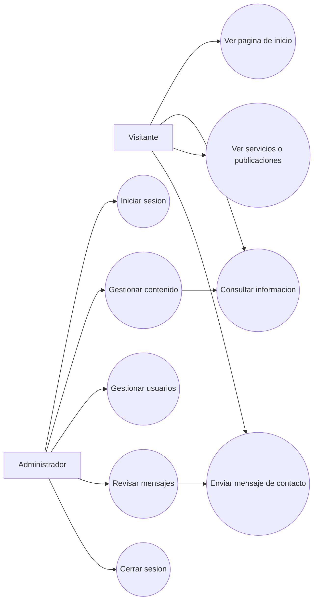

### 7.2 Caso de uso: Enviar mensaje de contacto

| Campo | Descripcion |
|---|---|
| Codigo | CU-01 |
| Actor principal | Visitante |
| Objetivo | Enviar un mensaje al equipo de Olympo. |
| Precondiciones | El visitante esta en la pagina de contacto. |
| Flujo principal | 1. El visitante abre el formulario. 2. Ingresa nombre, correo, asunto y mensaje. 3. El sistema valida los campos. 4. El sistema guarda el mensaje. 5. El sistema muestra confirmacion. |
| Flujos alternos | Si hay campos invalidos, el sistema muestra errores y no guarda el mensaje. |
| Postcondiciones | El mensaje queda registrado para revision administrativa. |

### 7.3 Caso de uso: Gestionar contenido

| Campo | Descripcion |
|---|---|
| Codigo | CU-02 |
| Actor principal | Administrador |
| Objetivo | Crear, editar, publicar, despublicar o eliminar contenido. |
| Precondiciones | El administrador inicio sesion correctamente. |
| Flujo principal | 1. El administrador accede al panel. 2. Selecciona gestion de contenido. 3. Crea o edita un registro. 4. El sistema valida la informacion. 5. El sistema guarda los cambios. |
| Flujos alternos | Si los datos son invalidos, el sistema muestra errores. |
| Postcondiciones | El contenido queda actualizado en el sistema. |

### 7.4 Caso de uso: Iniciar sesion

| Campo | Descripcion |
|---|---|
| Codigo | CU-03 |
| Actor principal | Administrador |
| Objetivo | Acceder al panel administrativo. |
| Precondiciones | El administrador posee credenciales registradas. |
| Flujo principal | 1. El administrador ingresa correo y contrasena. 2. El sistema valida credenciales. 3. El sistema crea una sesion. 4. El administrador accede al panel. |
| Flujos alternos | Si las credenciales son incorrectas, el sistema muestra un mensaje de error. |
| Postcondiciones | La sesion queda activa hasta que cierre sesion o expire. |

---

## 8. Modelo de dominio

### 8.1 Entidades principales

| Entidad | Descripcion |
|---|---|
| Usuario | Representa a una persona registrada en el sistema. |
| Rol | Define permisos o nivel de acceso. |
| Contenido | Representa informacion administrable publicada en la web. |
| Categoria | Agrupa contenidos por tipo o seccion. |
| MensajeContacto | Registra mensajes enviados por visitantes. |
| ConfiguracionSitio | Almacena datos generales del sitio. |

### 8.2 Diagrama entidad-relacion

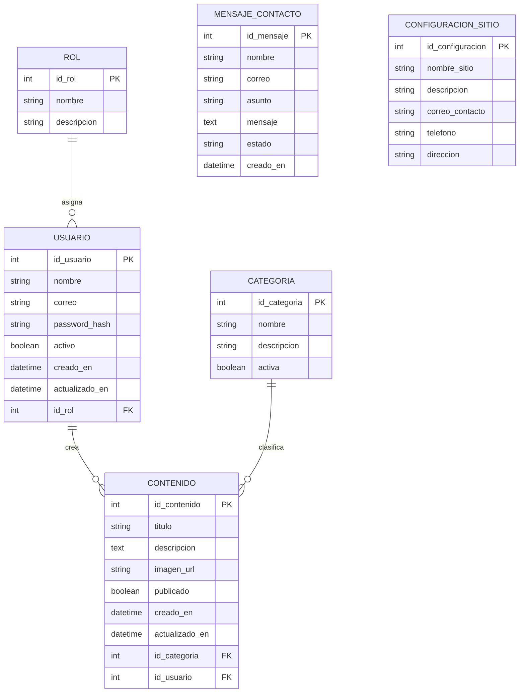

---

## 9. Diagrama de clases

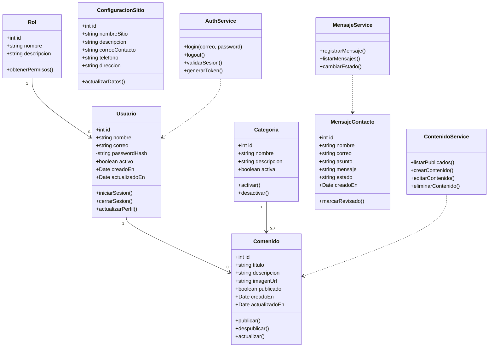

---

## 10. Arquitectura del sistema

### 10.1 Arquitectura propuesta

Se recomienda una arquitectura por capas:

- **Capa de presentacion:** paginas, componentes visuales, formularios y navegacion.
- **Capa de aplicacion:** controladores, servicios y reglas de negocio.
- **Capa de datos:** modelos, repositorios y acceso a base de datos.
- **Capa de infraestructura:** autenticacion, almacenamiento, servidor, despliegue y configuraciones.

### 10.2 Diagrama de componentes

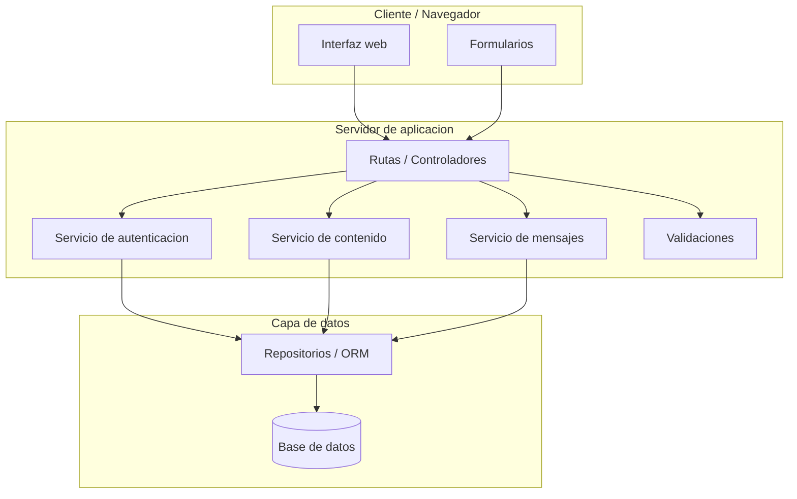

### 10.3 Diagrama de despliegue

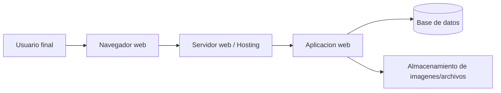

---

## 11. Diagramas de secuencia

### 11.1 Envio de mensaje de contacto

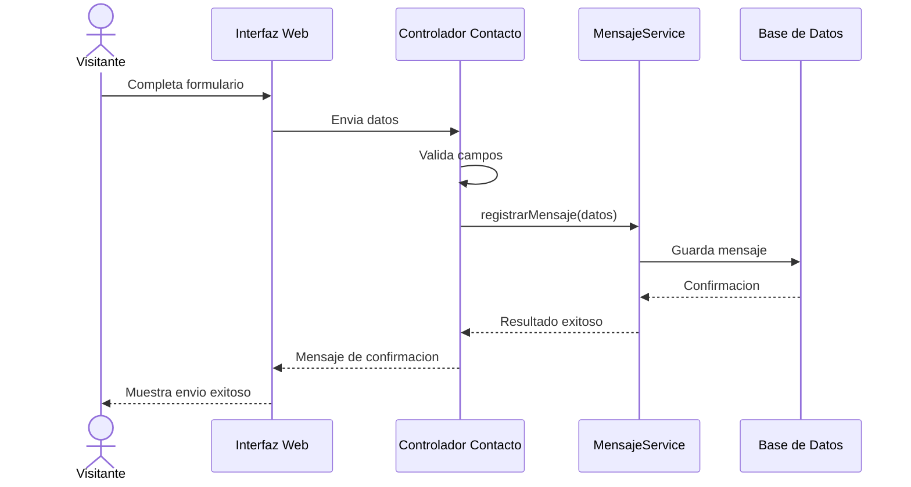

### 11.2 Inicio de sesion de administrador

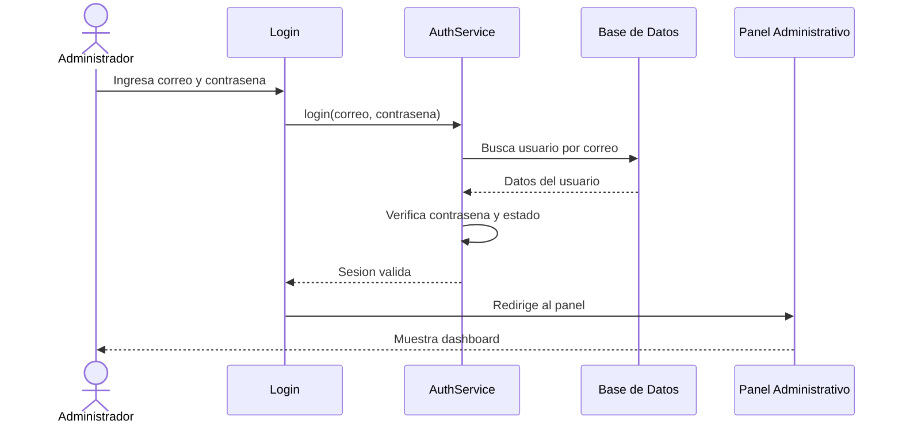

### 11.3 Publicacion de contenido

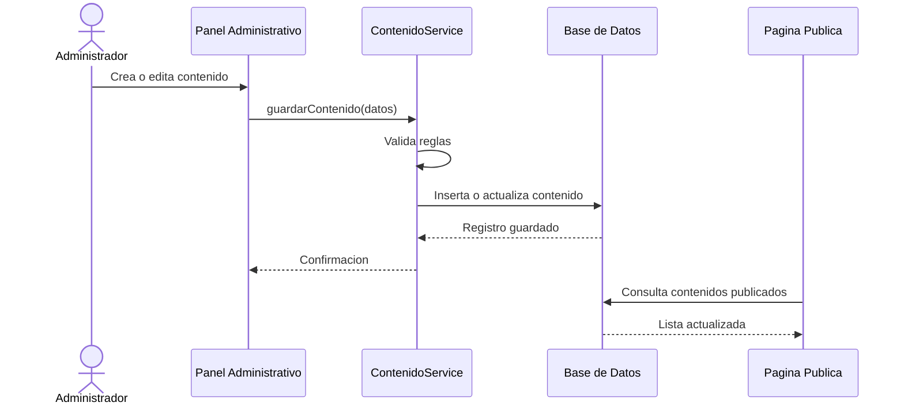

---

## 12. Diagramas de actividad

### 12.1 Flujo del visitante

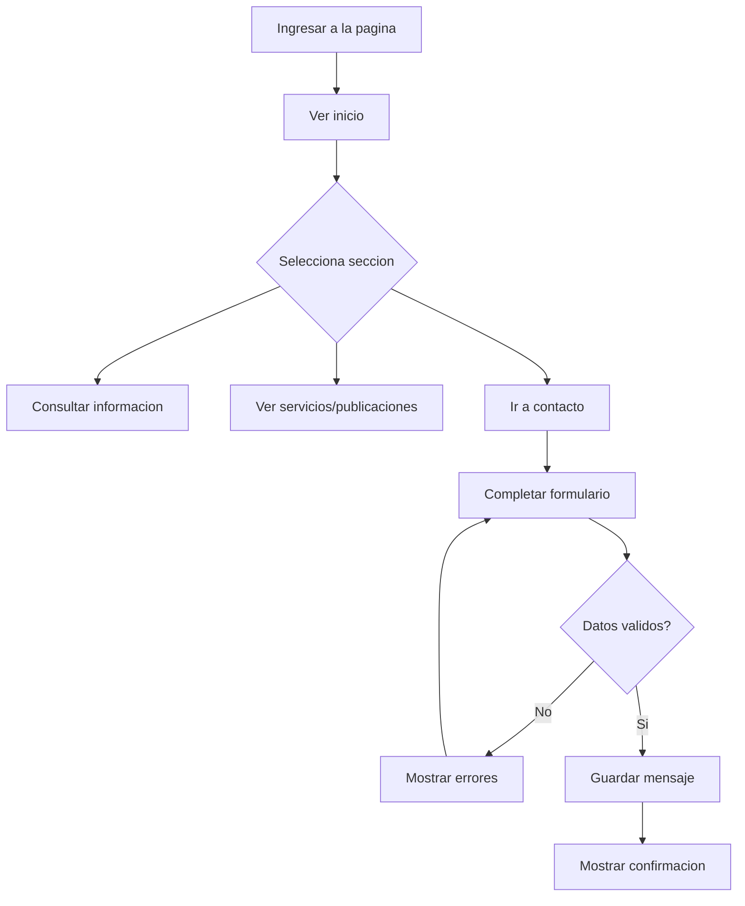

### 12.2 Flujo del administrador

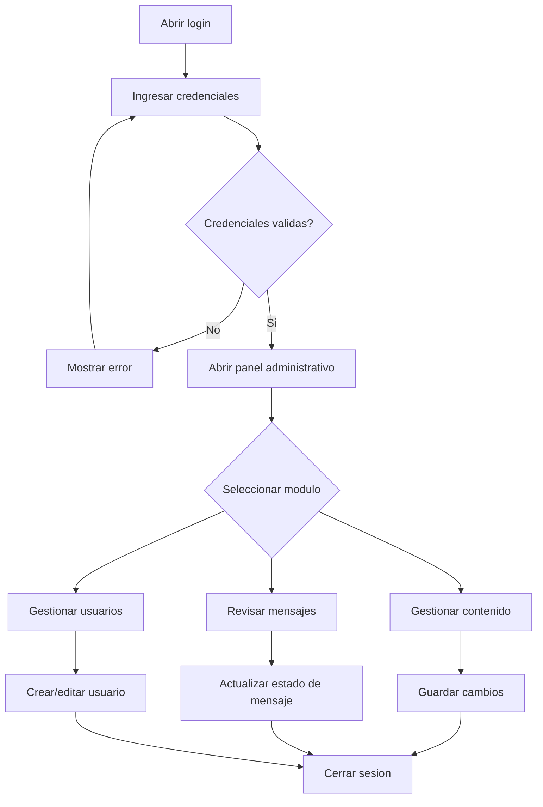

---

## 13. Prototipo logico de navegacion

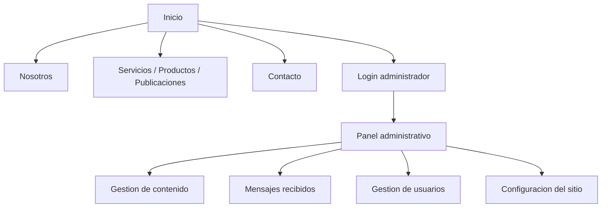

---

## 14. Modelo de datos sugerido

### 14.1 Tabla roles

| Campo | Tipo | Restricciones |
|---|---|---|
| id_rol | INT | PK, autoincremental |
| nombre | VARCHAR(50) | Obligatorio, unico |
| descripcion | VARCHAR(255) | Opcional |

### 14.2 Tabla usuarios

| Campo | Tipo | Restricciones |
|---|---|---|
| id_usuario | INT | PK, autoincremental |
| nombre | VARCHAR(100) | Obligatorio |
| correo | VARCHAR(120) | Obligatorio, unico |
| password_hash | VARCHAR(255) | Obligatorio |
| activo | BOOLEAN | Valor por defecto true |
| id_rol | INT | FK roles |
| creado_en | DATETIME | Obligatorio |
| actualizado_en | DATETIME | Obligatorio |

### 14.3 Tabla categorias

| Campo | Tipo | Restricciones |
|---|---|---|
| id_categoria | INT | PK, autoincremental |
| nombre | VARCHAR(100) | Obligatorio |
| descripcion | TEXT | Opcional |
| activa | BOOLEAN | Valor por defecto true |

### 14.4 Tabla contenidos

| Campo | Tipo | Restricciones |
|---|---|---|
| id_contenido | INT | PK, autoincremental |
| titulo | VARCHAR(150) | Obligatorio |
| descripcion | TEXT | Obligatorio |
| imagen_url | VARCHAR(255) | Opcional |
| publicado | BOOLEAN | Valor por defecto false |
| id_categoria | INT | FK categorias |
| id_usuario | INT | FK usuarios |
| creado_en | DATETIME | Obligatorio |
| actualizado_en | DATETIME | Obligatorio |

### 14.5 Tabla mensajes_contacto

| Campo | Tipo | Restricciones |
|---|---|---|
| id_mensaje | INT | PK, autoincremental |
| nombre | VARCHAR(100) | Obligatorio |
| correo | VARCHAR(120) | Obligatorio |
| asunto | VARCHAR(150) | Obligatorio |
| mensaje | TEXT | Obligatorio |
| estado | VARCHAR(30) | Pendiente, revisado, respondido |
| creado_en | DATETIME | Obligatorio |

### 14.6 Tabla configuracion_sitio

| Campo | Tipo | Restricciones |
|---|---|---|
| id_configuracion | INT | PK, autoincremental |
| nombre_sitio | VARCHAR(100) | Obligatorio |
| descripcion | TEXT | Opcional |
| correo_contacto | VARCHAR(120) | Opcional |
| telefono | VARCHAR(30) | Opcional |
| direccion | VARCHAR(255) | Opcional |

---

## 15. Matriz de trazabilidad

| Requerimiento | Historia relacionada | Caso de uso | Prueba sugerida |
|---|---|---|---|
| RF-01 | HU-01 | Ver pagina de inicio | Verificar carga de inicio y contenido principal. |
| RF-02 | HU-02 | Consultar informacion | Verificar navegacion entre secciones. |
| RF-05 | HU-03 | Enviar mensaje de contacto | Enviar formulario con datos validos. |
| RF-06 | HU-03 | Enviar mensaje de contacto | Enviar formulario con campos vacios o correo invalido. |
| RF-08 | HU-04 | Iniciar sesion | Probar credenciales validas e invalidas. |
| RF-10 | HU-04 | Iniciar sesion | Intentar acceder al panel sin sesion. |
| RF-11 | HU-05 | Gestionar contenido | Crear contenido desde el panel. |
| RF-12 | HU-06 | Gestionar contenido | Editar contenido existente. |
| RF-14 | HU-07 | Revisar mensajes | Listar mensajes recibidos. |
| RF-20 | HU-08 | Gestionar contenido | Publicar y despublicar contenido. |

---

## 16. Plan de pruebas

### 16.1 Pruebas funcionales

| ID | Escenario | Datos de prueba | Resultado esperado |
|---|---|---|---|
| PF-01 | Cargar pagina de inicio | Abrir URL principal | La pagina carga sin errores. |
| PF-02 | Navegar por menu | Clic en secciones | Cada seccion se muestra correctamente. |
| PF-03 | Enviar contacto valido | Nombre, correo valido, asunto, mensaje | El mensaje se guarda y se muestra confirmacion. |
| PF-04 | Enviar contacto invalido | Correo sin formato valido | El sistema muestra error. |
| PF-05 | Login valido | Credenciales correctas | El administrador accede al panel. |
| PF-06 | Login invalido | Credenciales incorrectas | El sistema rechaza el acceso. |
| PF-07 | Crear contenido | Titulo y descripcion validos | El contenido se registra. |
| PF-08 | Publicar contenido | Contenido existente | El contenido aparece en la pagina publica. |

### 16.2 Pruebas no funcionales

| ID | Tipo | Criterio |
|---|---|---|
| PNF-01 | Responsividad | La interfaz se adapta a celular, tablet y escritorio. |
| PNF-02 | Seguridad | Las rutas administrativas bloquean usuarios no autenticados. |
| PNF-03 | Rendimiento | Las paginas publicas cargan en tiempo aceptable. |
| PNF-04 | Compatibilidad | El sitio funciona en navegadores modernos. |
| PNF-05 | Usabilidad | Los usuarios pueden completar tareas principales sin confusion. |

---

## 17. Criterios de aceptacion generales

El proyecto sera aceptado cuando:

- La pagina publica muestre correctamente sus secciones principales.
- El formulario de contacto valide y registre mensajes.
- El administrador pueda iniciar y cerrar sesion.
- El panel administrativo permita gestionar contenido.
- Las rutas privadas esten protegidas.
- El diseno sea responsive.
- Los datos principales se guarden correctamente.
- Se hayan ejecutado pruebas funcionales basicas.
- La documentacion tecnica este disponible para mantenimiento.

---

## 18. Riesgos del proyecto

| Riesgo | Impacto | Probabilidad | Mitigacion |
|---|---|---|---|
| Cambios frecuentes de requerimientos | Alto | Media | Mantener documentacion actualizada y priorizar funcionalidades. |
| Falta de validacion en formularios | Alto | Media | Validar en frontend y backend. |
| Acceso no autorizado al panel | Alto | Media | Implementar autenticacion y proteccion de rutas. |
| Diseno no adaptable | Medio | Media | Probar en varios tamanos de pantalla. |
| Perdida de datos | Alto | Baja | Realizar respaldos y cuidar integridad de BD. |
| Bajo rendimiento | Medio | Media | Optimizar imagenes, consultas y carga de recursos. |

---

## 19. Recomendaciones de implementacion

- Usar una estructura clara por carpetas o capas.
- Separar componentes visuales, servicios, modelos y rutas.
- Validar todos los formularios.
- Manejar errores con mensajes comprensibles.
- Proteger credenciales y variables sensibles.
- Usar control de versiones con Git.
- Mantener nombres consistentes para clases, tablas y componentes.
- Crear respaldos periodicos de la base de datos.
- Documentar endpoints, componentes y decisiones importantes.

---

## 20. Conclusiones

El presente documento establece una base completa para aplicar ingenieria de software y levantamiento de requerimientos al desarrollo de la pagina web Olympo. Incluye requerimientos funcionales y no funcionales, reglas de negocio, historias de usuario, casos de uso, modelo de datos, diagramas de clases, componentes, secuencia, actividad, despliegue y plan de pruebas.

Este documento puede evolucionar durante el desarrollo del proyecto. Cada cambio relevante en funcionalidades, datos o arquitectura debe actualizarse para mantener la trazabilidad entre requerimientos, diseno, implementacion y pruebas.

